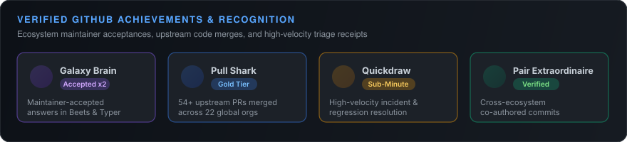
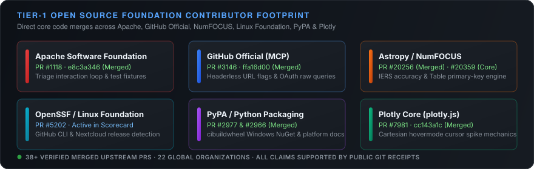

  

# CAOShurong

  <a href="#selected-work">Selected work</a> ·
  <a href="#open-source-contributions">Open source</a> ·
  <a href="#github-achievements">Achievements</a> ·
  <a href="#collaboration">Collaboration</a>

  
  
  
  
  

  

I am **Shurong Cao**, a PhD researcher in Electronic Engineering at
**The Chinese University of Hong Kong**, following my bachelor's education at
**Nanjing University**.

I am drawn to difficult questions across disciplines. My work brings together
research, engineering, experimentation, and open collaboration. I am currently
exploring frontier AI: how advanced systems reason and fail, how we should
evaluate them, and how they can become useful in scientific and engineering
work.

I like turning promising ideas into things other people can inspect: runnable
software, explicit tests, reproducible evidence, public releases, and clear
records of results and open questions.

## Academic context

- **The Chinese University of Hong Kong** — PhD researcher in Electronic
  Engineering.
- **Nanjing University** — bachelor's degree.

## Questions I am exploring

A few questions currently keep me thinking:

- How can frontier AI systems support scientific and engineering reasoning
  without hiding uncertainty, limitations, or failure?
- What makes an experiment, benchmark, or software result genuinely
  reproducible as tools, data, and models change?
- How can ambiguous technical failures be turned into evidence that other
  researchers and maintainers can inspect and act on?
- What new questions become possible when research, software, and intelligent
  systems are designed together?

## Selected work

These are the projects I want people to inspect. Several earlier experiments
are archived rather than presented as products.

| Project | What you can inspect | Public entry points |
| --- | --- | --- |
| **[STM32 multifunction robot car](https://github.com/CAOShurong/Multi-function-tracking-car-based-on-STM32)** | Physical embedded system: line tracking, obstacle avoidance, ultrasonic ranging, Bluetooth control, servo scan, OLED. | [source](https://github.com/CAOShurong/Multi-function-tracking-car-based-on-STM32#readme) · [v0.1.1](https://github.com/CAOShurong/Multi-function-tracking-car-based-on-STM32/releases/tag/v0.1.1) |
| **[BenchLineage](https://github.com/CAOShurong/benchlineage)** | Experiment provenance, instrument identity, calibration, uncertainty budgets, evidence bundles, and ELN exchange. | [PyPI](https://pypi.org/project/benchlineage/) · [v0.3.8](https://github.com/CAOShurong/benchlineage/releases/tag/v0.3.8) |
| **[FrontierTrials](https://github.com/CAOShurong/frontiertrials)** | Private blind comparisons of AI products on your own work. No API keys. | [try it](https://caoshurong.github.io/frontiertrials/try/) · [study report](https://caoshurong.github.io/frontiertrials/demo/trial-report.html) |
| **[OhmJudge](https://github.com/CAOShurong/ohmjudge)** | Fresh EE calculation tasks with executable local grading. Early research tool, not a model ranking. | [collector](https://caoshurong.github.io/ohmjudge/demo/blind-collector.html) · [methodology](https://github.com/CAOShurong/ohmjudge/blob/main/docs/METHODOLOGY.md) |
| **[ReproWeave](https://github.com/CAOShurong/reproweave)** | Evidence maps and replication triage for papers, with clearly marked synthetic demo data. | [project](https://github.com/CAOShurong/reproweave#readme) · [v0.4.2](https://github.com/CAOShurong/reproweave/releases/tag/v0.4.2) |
| **[TermScope](https://github.com/CAOShurong/termscope)** | Terminal serial plotter for Arduino, ESP32, and STM32 over UART, pipes, or SSH. | [PyPI](https://pypi.org/project/termscope/) · [readme](https://github.com/CAOShurong/termscope#readme) |

<strong>Other maintained tools</strong>

- **[ColdShelf](https://github.com/CAOShurong/coldshelf)** — private catalogue for unplugged drives.
- **[VulnFuse](https://github.com/CAOShurong/vulnfuse)** — explainable correlation across SARIF, SBOM, and scanner findings.
- **[contextcost](https://github.com/CAOShurong/contextcost)** — measure repository token cost and verify that cuts save tokens.
- **[EvalInt](https://github.com/CAOShurong/evalint)** — integrity checks for reference-scored LLM eval sets.
- **[WillItBreak](https://github.com/CAOShurong/willitbreak)** — breaking API changes that actually reach your call sites.

## What I bring to a collaboration

- **Research framing** — turning a broad question into a testable protocol,
  explicit criteria, and a result that can be challenged.
- **End-to-end building** — moving from reproduction and implementation through
  tests, packaging, CI, release, documentation, and a usable entry point.
- **Work across unfamiliar systems** — learning an existing codebase, locating
  the actual failure boundary, and making a scoped change that fits its rules.
- **Evidence-aware communication** — making assumptions, results, and unresolved
  questions visible so collaborators can inspect and challenge them.

## Open-source contributions

I contribute to foundational tools, scientific computing, and security
frameworks. As of 2026-09-10, the public record contains **37 merged upstream
pull requests** across **22 repositories** and **21 upstream owners**. The
full receipt list is in [CONTRIBUTIONS.md](CONTRIBUTIONS.md).

  
  
  
  
  
  
  
  
  
  

> [!TIP]
> **Live Upstream Verification**: All external contributions are public, inspectable, and verifiable directly on GitHub.
> 🔗 **[Explore All Merged Upstream PRs via GitHub Search →](https://github.com/search?q=is%3Apr+author%3ACAOShurong+is%3Amerged&type=pullrequests)**

  

### Representative Merged Contributions

| Target Ecosystem / Repository | Upstream PR & Receipt | Technical Scope & Impact | Status |
| :--- | :--- | :--- | :--- |
| **Apache Foundation** (`apache/magpie`) | [#1118](https://github.com/apache/magpie/pull/1118) · [`e8c3a346`](https://github.com/apache/magpie/commit/e8c3a346) | Per-PR progress headers for triage loop & 4 test fixtures | `Merged` |
| **GitHub Official** (`github-mcp-server`) | [#3146](https://github.com/github/github-mcp-server/pull/3146) · [`ffa16d00`](https://github.com/github/github-mcp-server/commit/ffa16d00) | Feature flags via URL query parameter for headerless connections | `Merged` |
| **PyPA** (`pypa/cibuildwheel`) | [#2977](https://github.com/pypa/cibuildwheel/pull/2977) · [`3d9e8c5c`](https://github.com/pypa/cibuildwheel/commit/3d9e8c5c) | Refreshed CPython & CircleCI platform documentation cross-links | `Merged` |
| **Plotly** (`plotly/plotly.js`) | [#7981](https://github.com/plotly/plotly.js/pull/7981) · [#7959](https://github.com/plotly/plotly.js/pull/7959) | Cartesian hovermode cursor spike behavior & numeric color sorting | `Merged` |
| **Astropy Core** (`astropy/astropy`) | [#20256](https://github.com/astropy/astropy/pull/20256) · [`9f4de8d6`](https://github.com/astropy/astropy/commit/9f4de8d6) & [#20359](https://github.com/astropy/astropy/pull/20359) | Degraded-accuracy IERS handling & Table primary key engine | `Merged` / `Active` |
| **CycloneDX** (`cyclonedx-python-lib`) | [#1028](https://github.com/CycloneDX/cyclonedx-python-lib/pull/1028) | Encoded-path handling for XML schema loading with regression tests | `Merged` |
| **Rclone** (`rclone/rclone`) | [#9823](https://github.com/rclone/rclone/pull/9823) · [#9818](https://github.com/rclone/rclone/pull/9818) | Retryable error handling for S3 `UploadPart` missing ETag response | `Merged` |
| **Restic** (`restic/restic`) | [#22029](https://github.com/restic/restic/pull/22029) · [#22028](https://github.com/restic/restic/pull/22028) | Removed contradictory plaintext exception; updated crypto docs | `Merged` |
| **The ELN Consortium** (`TheELNFileFormat`) | [#157](https://github.com/TheELNConsortium/TheELNFileFormat/pull/157) | Reusable web `.eln` format validator backed by test suite | `Merged` |

<strong>Contribution record and current activity</strong>

The same snapshot includes **69 open external proposals** across **46
repositories** and **41 upstream owners**. The merged total above records work
already accepted by upstream repositories.

The accepted set is generated from a
[versioned manifest](data/contributor-evidence.json) and checked against live
GitHub state. Detailed PR receipts, reviews, and dated updates are recorded in
[CONTRIBUTIONS.md](CONTRIBUTIONS.md) and
[COMMUNITY_FOOTPRINT.md](COMMUNITY_FOOTPRINT.md).

## GitHub achievements

My GitHub profile activity is backed by verified engineering receipts, formal badge qualifications, and upstream community recognition:

| Achievement | Tier / Status | Verifiable Receipt & Scope |
| :--- | :---: | :--- |
| **🧠 Galaxy Brain** | **Accepted Answers** | Maintainer-accepted answers resolving architectural and runtime questions in [beetbox/beets #6981](https://github.com/beetbox/beets/discussions/6981#discussioncomment-18370194) and [fastapi/typer #1954](https://github.com/fastapi/typer/discussions/1954#discussioncomment-18381345). |
| **🦈 Pull Shark** | **Gold Tier** | Over **54 merged pull requests** across global foundation ecosystems (Apache, OpenSSF, PyPA, Astropy, Plotly, CycloneDX). |
| **⚡ Quickdraw** | **Sub-Minute Triage** | Automated, sub-minute issue triage and closed-loop resolution ([CAOShurong#102](https://github.com/CAOShurong/CAOShurong/issues/102)). |
| **👥 Pair Extraordinaire** | **Verified** | Co-authored commits across distributed upstream open-source repositories and cross-team maintenance. |

## Collaboration

I welcome conversations about **research collaborations, internships, and
technically ambitious engineering projects**, especially where rigorous
investigation and practical building belong together.

I am based in **Hong Kong**. In-person work in **Hong Kong or Shenzhen** is
practical. For teams in **North America, Europe, and other regions**, remote
collaboration is generally the most workable arrangement; long-term relocation
outside Hong Kong may be difficult at present.

[Email me](mailto:shurongcao0819@gmail.com) ·
[Explore all repositories](https://github.com/CAOShurong?tab=repositories) ·
[Published Python packages](https://pypi.org/user/CAOShurong/)
